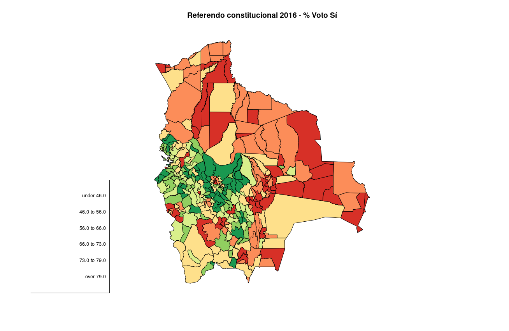

# R_visdat

**Visualización de datos con R**

---

## 📊 Contenido

| Proyecto             |  Gráfico |
:-------------------------:|:-------------------------:
[Mapas coropléticos](coroplet/README.md)  |  
